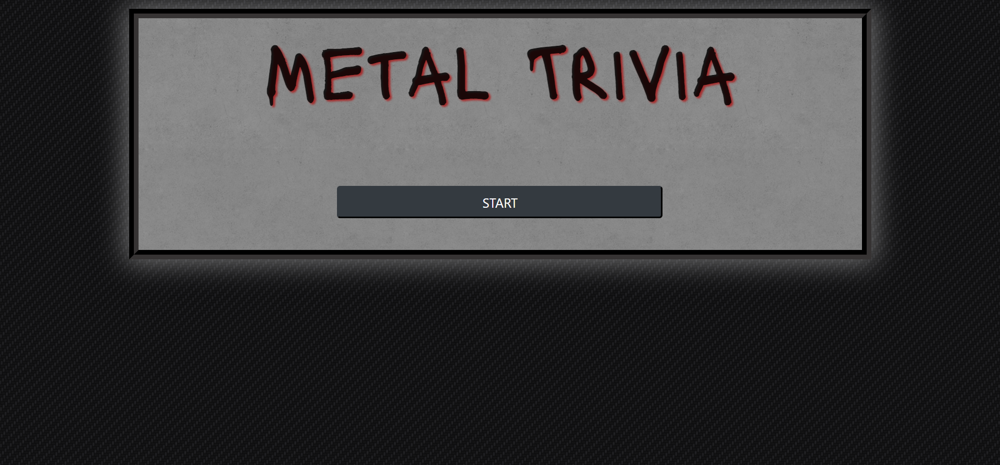

# Metal Trivia Game

**Creator**: `Scott Ladd`

**Created on**: `Oct 21st 2019`

- - -
### ABOUT THE APP

A Metal based Trivia game that uses JavaScript for the logic and jQuery to manipulate HTML. The object of the game is to answer the question within the allotted amount of time.

### HOW TO PLAY

Once the page loads, click the start button to begin. Each question is timed and you progress is tracked at the bottom via the progress bar. 
If you fail to answer the question within 4 seconds the question is marked wrong and it moves on to the next one. Good luck!

### Deployed Site

[Click Here](https://scottjr101.github.io/TriviaGame/)

- - -

## TECHNOLOGIES USED
* Javascript
* CSS
* HTML
* BootStrap
* Git
* GitHub